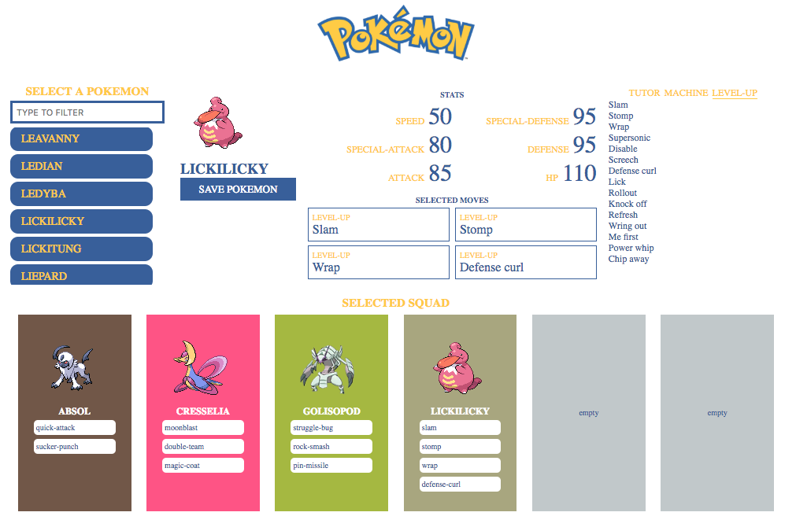

# Frontend recruitment

This is an exercise to test your knowledge of **React**, **styled-components** & **GraphQL**. You shouldn't spend more than X hours on it. If you don't finish the exercise between these hours that's not a problem as long as you can write down why and how you would finish the exercise.

Don't worry to much about the code you produce, there is **no correct solution**. We will have a chat about this exercise anyway so you have time to talk about shortcuts you made.

## Introduction

To keep things light and because it was one of the publicly available Graphql API's, you'll be working with Pokémon 🎉

The general idea of the task will be to develop a single page application that enables you to pick a pokemon, choose a maximum of 4 moves that that pokemon can learn, and add it to your squad. As with all pokemon games, your squad is limited to a maximum of 6 pokemon.

The following paragraphs will give a more detailed overview of the three main functions: picking a pokemon, choosing the moves and adding it to your line-up.

Feel free to use as many open source components as you like. For the autocomplete our go to component is [Downshift](https://github.com/paypal/downshift).



# Source code

When you are finished with your version, please host this somewhere on Github and share your link.

## Picking a Pokémon

Using the API, you will be fetching a complete list of all avaible pokemon. This list will be presented to the user.

The user should also have the ability to filter this list through a text input. When entering a value in the input field, only pokemon names starting with the provided input should still be visible.

Clicking a particular pokemon will set this as the current pokemon that is displayed in the detail section.

## Pokemon detail

When a particular pokemon is selected, a new API call will gather detailed information about this pokemon.

This detail section will extract the pokemon's stats, moves and type and will display these values.

The image will be display above the name. The stats will be presented in a 2x3 grid. The moves will be divided in the possible ways of learning them. Do note that not all pokemon have moves in all 4 ways (level-up, tutor, egg, machine).

You can select these moves and they will be added to the list of selected moves. The amount of selected moves is limited to 4. The amount is not the only limitation, as 3 of the 4 learning methods should only have maximun 1 selected move. I.e. you can only have 1 machine-learned move, 1 egg-learned move and 1 tutor-learned move. The amount of level-up-learned moves is unlimited.

Examples of combinations that are allowed:

- 1 egg-learned move, 1 tutor-learned move, 1 machine-learned move, 1 level-up-learned move
- 1 tutor-learned move, 2 level-up learned moves
- 4 level-up learned moves
- 1 egg-learned move

Examples that are not allowed:

- No moves
- 2 tutor-learned moves
- 2 level-up-learned moves and 2 machine-learned moves

To remove a move from the selected moves, you have to click the move in the move-list again. The move-list thus functions as a toggle as to selecting and unselecting a move.

Clicking "Save pokemon" will add that pokemon to your squad with the moves you selected.

# API Detail

To save you from having to dig through the API docs, here is an [igraphql](https://graphql-pokemon.now.sh) interface to query the data. The graphql endpoint is https://pokeql.com/. It's also saved inside `process.env.REACT_APP_POKE_ENDPOINT` so you can use it in your application.

You will be using 2 queries, one for listing all available pokemon and one for getting more detail about a single pokemon.

## All available pokemon

```
Pokemon(first: 151) {
  fields
}
```

Calling this query will return you a list of all pokemon

## Pokemon detail

```
Pokemon(filter: {identifier: "snorlax"}) {
  fields
}
```

Calling this endpoint will return you a detailed overview of the requested pokemon.

You are interested in 4 fields.

### Sprites`

We will want to use `sprites.normal.mail.front` as our pokemon image.

### pokemonStats

We are only interested in the `base_stat` and `stat` object, where we'll only be using the `stat.identifier` field.

### Types

We are only interested in the type that is in `slot` 1. From this stat, we are only interested in the `type.identifier` field.

### Moves

We are only interested in the `move.identifier` field and the first element in `pokemonMoveMethod`. In this task, the first element's `pokemonMoveMethod.identifier` is the one that determinates the move's method.

# Colors

There are a total of 4 colors used for general styling.

- Blue: #3A5D9F
- Yellow: #FDCC07
- White: #FFFFFF
- Grey: #C1C8CA

As discussed in a previous point, all selected pokemon will have the background-color corresponding to their type.

The list of colors corresponding to every type:

- Normal Type: #A8A77A
- Fire Type: #EE8130
- Water Type: #6390F0
- Electric Type: #F7D02C
- Grass Type: #7AC74C
- Ice Type: #96D9D6
- Fighting Type: #C22E28
- Poison Type: #A33EA1
- Ground Type: #E2BF65
- Flying Type: #A98FF3
- Psychic Type: #F95587
- Bug Type: #A6B91A
- Rock Type: #B6A136
- Ghost Type: #735797
- Dragon Type: #6F35FC
- Dark Type: #705746
- Steel Type: #B7B7CE
- Fairy Type: #D685AD

# Technical requirements

The master branch this project can be used as a starter kit for the project. Cloning it and running `yarn install` and `yarn start` should present you with a ready-to-go React app.

There are already some packages included in the package.json, but you **are allowed to use other third-party packages**.
